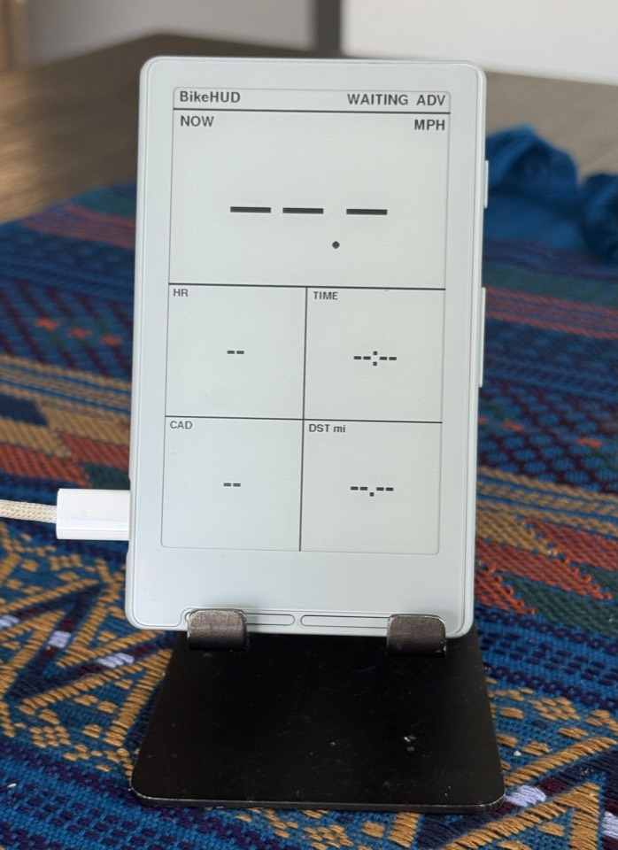

# BikeHUD

[](https://github.com/k5njm/BikeHUD/actions/workflows/ci.yml)
[](LICENSE)
[](#status--wip)

> **Work in progress.** Sunlight-readable e-ink bike computer on the **Xteink X4** (ESP32-C3), driven by an iPhone hub over BLE. Expect breaking changes; not a finished product.

<p align="center">
  
</p>

<p align="center"><em>Desk unit, waiting for the iOS hub (imperial UI, BLE advertising).</em></p>

```
Cadence (later) ──BLE CSC──┐
Apple Watch ──HealthKit HR─┤
Phone GNSS ────────────────┼──►  iOS hub  ──BLE──►  X4 HUD
Workout clock ─────────────┘   (jersey/pocket)      (bars)
```

The phone owns sensors and the workout. The X4 is a **dumb peripheral**: parse a fixed 16-byte packet, partial-refresh big digits (Cycplus-style layout, imperial by default).

## Status — WIP

| Area | State |
|---|---|
| Wire protocol v1 | Frozen (16 B LE) + host/Swift tests |
| X4 firmware (NimBLE + GxEPD2 HUD) | Builds, flashes, desk-tested |
| Restore CrossPoint / full flash backup | Documented + scripts |
| iOS hub (BLE central, demo + GPS ride) | Source + Xcode project; on-device install TBD |
| HealthKit HR / CSC cadence | Not started |
| watchOS hub | Not started |
| CI | Protocol tests + firmware + Swift tests + iOS simulator |
| Signed App Store / TestFlight IPA | Not planned yet (needs paid Apple Developer Program) |

Roadmap: [`docs/roadmap.md`](docs/roadmap.md) · Docs index: [`docs/README.md`](docs/README.md)

## Repo layout

| Path | Role |
|---|---|
| [`protocol/`](protocol/) | Shared wire format (C header + docs + host tests) |
| [`firmware/`](firmware/) | PlatformIO app for the X4 |
| [`ios/BikeHudProtocol/`](ios/BikeHudProtocol/) | Swift package (encode/decode + XCTest) |
| [`ios/BikeHudApp/`](ios/BikeHudApp/) | iOS 16+ SwiftUI hub app |
| [`docs/`](docs/) | Architecture, hubs, flash/restore, CI, photos |
| [`scripts/`](scripts/) | Backup / restore helpers |

## Quick start — firmware (X4)

```bash
cd firmware
pio run -e x4           # BLE + HUD
pio run -e x4_demo      # synthetic digits, no BLE
pio run -e x4 -t upload
pio device monitor      # 115200
```

**Before first custom flash**, back up the full 16 MB SPI image (exact restore of CrossPoint/stock):

```bash
./scripts/backup-x4.sh /dev/cu.usbmodemXXXX
```

Restore CrossPoint: [web flasher](https://crosspointreader.com/#flash-tools) or

```bash
./scripts/restore-crosspoint.sh /path/to/crosspoint-firmware.bin
./scripts/restore-crosspoint.sh --full backups/x4-full-….bin
```

Details: [`docs/flash-and-restore.md`](docs/flash-and-restore.md).  
USB-unlocked X4 only for third-party firmware; see CrossPoint unlock notes if the device does not enumerate.

## Quick start — iOS

Needs **full Xcode** and a **physical iPhone** (BLE to the X4). A free Apple ID **Personal Team** is enough for local installs (~7‑day re-sign).

```bash
open ios/BikeHudApp/BikeHudApp.xcodeproj
```

1. Signing → your Personal Team  
2. Run on device → allow Bluetooth  
3. Connect **BikeHUD** → **Demo ride → Start**

More: [`ios/README.md`](ios/README.md)

## Tests & CI

```bash
# C protocol host tests (no hardware)
cc -std=c11 -I protocol -o /tmp/test_protocol protocol/tests/test_protocol.c && /tmp/test_protocol

# Swift package tests (needs Xcode for XCTest)
cd ios/BikeHudProtocol && swift test
```

| Workflow | What it does |
|---|---|
| [CI](.github/workflows/ci.yml) | Protocol C tests · firmware `x4`/`x4_demo` · `swift test` · iOS Simulator build |
| [Release](.github/workflows/release.yml) | Tag `v*` → GitHub Release with firmware `.bin` artifacts |

**Signed device IPA in CI** needs Apple certs as secrets (usually paid Developer Program). See [`docs/ci.md`](docs/ci.md).

```bash
git tag v0.1.0 && git push origin v0.1.0
```

## Contributing

Please use **issues** and **pull requests** — see [`CONTRIBUTING.md`](CONTRIBUTING.md).

## Design constraints

1. **X4 has no PSRAM** — keep the firmware thin; hub owns sensors.  
2. **X4 = BLE peripheral only** for the phone link.  
3. **E-ink** — partial updates for live data; full waveform only after many partials (ghost cleanup).  
4. **Metric on the wire**, display units on the HUD (imperial default).  

## Inspiration (not dependencies)

- [CrossPoint / FreeInk](https://github.com/crosspoint-reader/crosspoint-reader) — pins, panel, partitions  
- [xteink-x4-sample](https://github.com/CidVonHighwind/xteink-x4-sample) — GxEPD2 bring-up  
- [stravaV10](https://github.com/vincent290587/stravaV10) — sensor age, compact ride UI ideas  

## License

[MIT](LICENSE)
